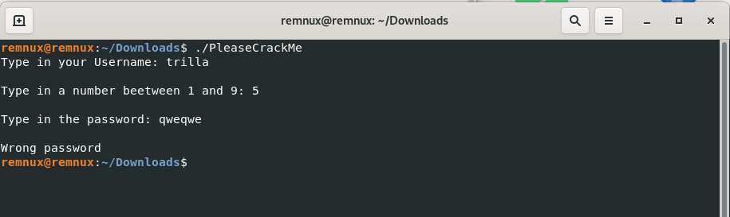
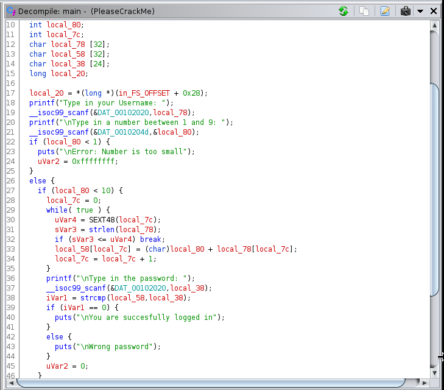
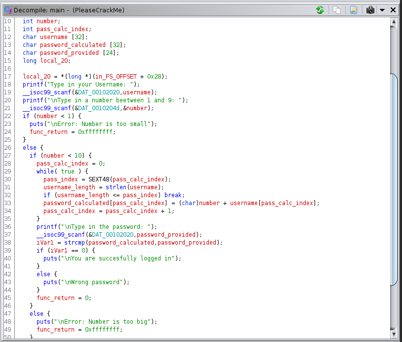
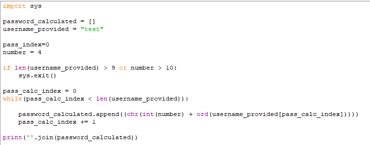
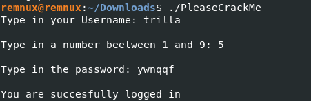

# PleaseCrackMe Solution
***

I really love the feeling when I came back after long break to something and even if this is marked as simple, I'm still happy because of resolution. This crackme was downloaded from crackmes.one - platform which was made after crackmes.de went offline.
You can download it here - https://crackmes.one/crackme/612e85d833c5d41acedffa4f. It's marked as Difficulty 1.3 and Quality: 4.6
***

# Used software:

### Let's start...
For test purpose and what we get displayed on trial, I just run this with some random values

As we see it's showing us some strings we could use by typing strings PleaseCrackMe in terminal but I just added this to Ghidra.
It was good move because we saved time as main function was responsible for everything in this case (no subfunctions for generating and so on, but hey - it's marked as 1.3
When we select main from functions on left menu we see below code:

We can see simple algorithm that is working in loop- taking converted to char sum of our loop index and converted to int char from nickname. Let's simplify this code!

Now we can see better that function and what it's doing. We can now prepare keygen for this by only copying this logic to python and replace it for proper python syntax 

This code is doing exactly the same (here values are hardcoded but can be easily replaced with args), so:
1. In loop its going until index of provide username is shorter than length of this value
2. It's adding number to integer value of char taken from corresponding sign from username (using pass_calc_index value)
3. Converting this back to char take from sum value
***

### Let's test this!
For value "trilla" and number 5 it's showed us password "ywnqqf". After entering this we got in :)

