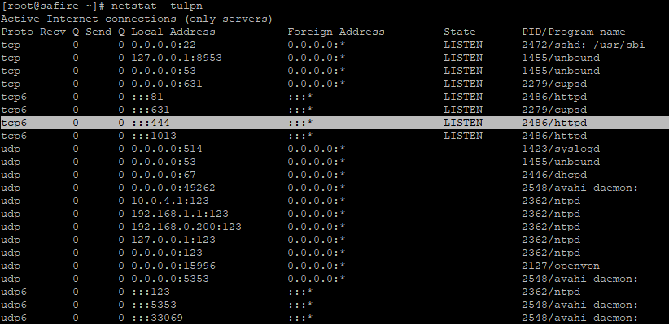
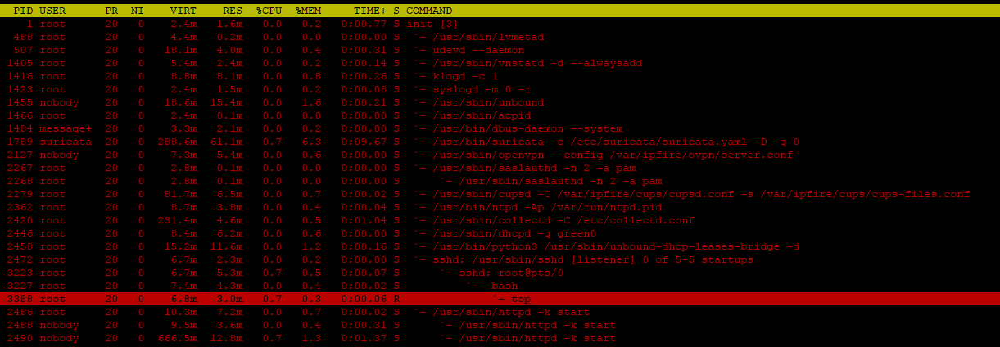
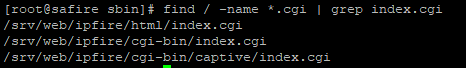
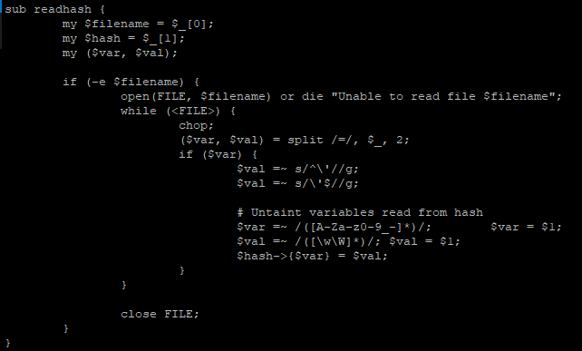
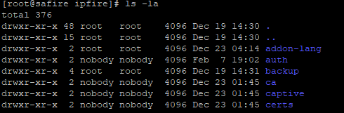
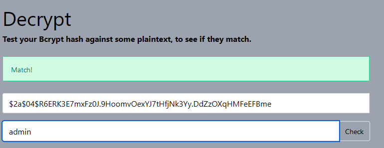

# How to reset ipFire GUI password
***

Recently I bought Juniper SA 2500 (old but gold) VPN to my homelab to make vpn connection to my another toy which is IBM X3650 M2. I needed this to make it secure and to make possible working remotely on my projects that are hosted in VM's (IBM is running proxmox). I decided to buy this appliance but I had in mind that I need to reinstall Juniper OS to something more modern. After playing with pfSense (it was killer to my needs), I tested OPNSense (which didn't even start) and I eneded with ipfire software (which is really great so far). But the problem started when I set up GUI password during installation and then I couldn't find place to replace that. Then I started sniffing...
***

### TLDR
1. Generate bcrypt hash with password you want to use
2. SSH to your ipfire appliance
3. echo 'admin:<your bcrypted="" here="" password="">' &gt; /var/ipfire/auth/users</your>
### Below is whole process I made
***

# First step - SSH for the win!
When you login to gui with some shitty password you had to input while your case to applince is opened (to access VGA output) and you couldn't copy-paste this from password manager like KeePass, you have to enable SSH connections.
 

### Second step - find whatever that is related to webserver
I used netstat -tulpn to find what software, what PID, and what path is related to port 444 which is default port for www server on ipfire
 

 

We see it's not Apache, it's not nginx it's just regular httpd server, so we can use top to see path used by this.
 

 

The last line is reveal us path used by httpd server. And when I use command "strings /usr/sbin/httpd" I changed my way to solve it.
 

In general when we are trying to login to GUI we got normal popup for Basic auth known from apache - just user and password, no fancy graphics, and of course 401 Unathorized when we click on Cancel.
 

I focused on finding where is index.cgi and this lead me to 3 paths
 

 

I started to "cat" them and nothing useful was found - but(!) we know path used by www server, it's more than enough. In /srv/web/ipfire/ we got two subfolders. One is cgi-bin and second one is html. And in the second folder I got what I needed - but only half of part.
 

 

Here we got hash reading function that is comparing provided value in popup and checking with... yeah... checking with some file, so I started digging once again. In cgi-bin/index.cgi there were paths like /var/ipfire. Let's see what's there.
 

I cutted screenshot for clarity but we don't have to scroll so much ;)
 

 

Folder auth is containing what we exactly need! In users file that is located there is our user and hash like "user:hash". For purpose of this material let's assume it's
 

Now the fun part is that we don't know exactly what the hash is and hash-identifier from Kali Linux also didn't know, as well as other online hash type finders. I opened https://regex101.com/ and I pasted there hash part after ":". If you ask me where I found regex to match the answer is of course in screenshot with hash function.
 

$var =~ /([A-Za-z0-9_-]*)/;        $var = $1;
$val =~ /([\w\W]*)/; $val = $1;
$hash->{$var} = $val;

Above part is giving us what exactly is taken for hash so value taken and what? And regex wasn't parsing this to "sub-take" for final comparing.
    Hash used here was BCRYPT. And when we compare this on some brypt generator site we can see match (bcrypt rounds doesn't matter).
 

 

### Final step - overwrite previous password!
Let's generate something strong, something that keepass is suggesting us, pass it through bcrypt generator found in google and let's overwrite file users with command "echo 'admin:$2a$04$R6ERK3E7mxFz0J.9HoomvOexYJ7tHfjNk3Yy.DdZzOXqHMFeEFBme' > /var/ipfire/auth/users
 

### All done!
